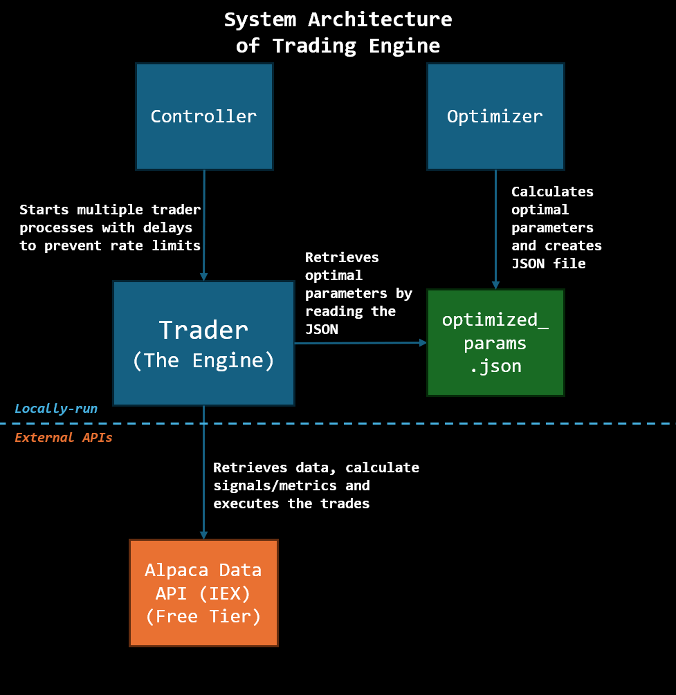

# Pairs-Trading Engine (Paper Trading, Alpaca + IEX)

This is a **pairs-trading system** that uses dynamic hedge ratios (via a Kalman filter) and mean-reversion signals (via Z-score + Hurst/ADF filters), built to run on the free tier of the Alpaca API (IEX feed + rate-limit / latency constraints).

You may find the live paper account status (equity, entry/exit updates) here: [**Telegram**](https://t.me/+12M82bTPLAtjMzZl)

---

## Architecture Overview

 

The design cleanly separates calibration (offline) from execution (live), enabling multiple pairs to trade concurrently while limiting API pressure.

## Contents

- `controller` — launches and monitors multiple trader processes, spaced out to respect API rate limits.  
- `trader` — retrieves streaming data, calculates signals (beta, spread, z-score, volatility, Hurst/ADF), and executes trades (paper mode) on Alpaca.  
- `optimizer` — runs historical backtests and calibrates optimal entry/exit thresholds per pair, storing them in a JSON config used by live traders.

---

## How to Use (Guide)

1. Clone the repo  
2. Copy `.env.example` to `.env`, and fill in your Alpaca & Telegram API keys (or run without Telegram)  
3. Install dependencies: `pip install pandas numpy requests scipy statsmodels numba alpaca-py python-dotenv` or with `pip install -r requirements.txt`  
4. Run `optimizer.py` to generate `optimized_params.json`  
5. Start controller: `python controller.py`, supplying your list of pairs (follow `pairs.json` as an example) or supplying them as environment/config file  

---

## Important Notes & Limitations

- **Free-tier data only**: using IEX feed — data sparsity, latency, and incomplete quotes may cause mis-fills or missed signals. I highly recommend if that you can somehow get SIP data, please use it.
- **Prototype stage**: This is an educational proof-of-concept. Risk controls, sizing, and model logic are simplified.   
- **No guarantee for live trading** — treat this as a sandbox/backtest tool.  

---

## Disclaimer

Use at your own risk.  
This is intended for educational purposes and research.  
