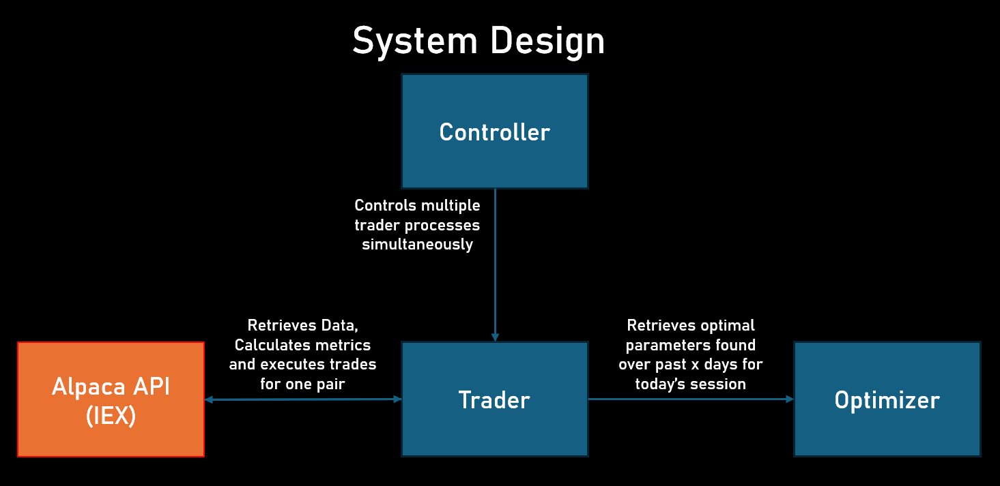

# Pairs Trading Paper Trading Algorithm

This is a pairs trading algorithm utilizing Kalman Filters and Hurst Exponents to trade mean-reverting pairs.

## This repository contains the code for:

**Controller**: Manages the paper-traders concurrently (seeking to run about 20-25 traders)

**Trader**: Interacts with the Alpaca API to simulate the trading while calculating the kalman beta and other metrics.

**Optimizer**: Backtests recent data to calibrate optimal Z-score entry/exit thresholds for the current trading session.

---

**The system monitors equity and positions in real time. Results can be viewed on my Telegram channel:**

[Telegram Channel (equity & positions updates every few minutes)](https://t.me/+12M82bTPLAtjMzZl)

---

> **Note:** Code was written by me with assistance from AI and Online Forums. All mathematical logic has been manually reviewed. This project is a proof of concept and DEFINITELY CONTAINS bugs, mistakes and heuristic parameter choices.

